# GemmaFin — Production-Grade Conversational Financial Assistant


[](https://blog.google/technology/ai/google-gemma-4-ai-model/)
[](https://opensource.org/licenses/MIT)
[](https://web.dev/progressive-web-apps/)
[]()
[]()
[]()

> **An AI-powered personal finance Progressive Web App (PWA) specifically designed for low-income families and informal workers. It leverages the multimodal power of Gemma 4 E2B to turn financial tracking and planning from a cognitive burden into a simple, natural conversation.**

---

## 📖 Executive Summary

Conventional personal finance applications fail because they impose excessive cognitive friction, requiring rigorous manual input, transaction categorization, and a high degree of financial literacy. This entry barrier is especially high for informal workers, who operate in fast-paced cash-and-Pix environments and struggle to track dynamic earnings.

**GemmaFin** subverts this paradigm by providing a clean, messaging-based interface designed to be as simple as sending a chat message:
* **Simulated Voice Transcription:** Users can record audio memos reporting earnings and expenses directly (e.g., informal day jobs, groceries, haircuts).
* **Vision OCR Processing:** Users can snap photos of crumpled receipts or bank statements, which are read and incorporated into the ledger.
* **Point-of-Sale Opportunity Cost Engine:** Immediate feedback comparing Pix cash discounts against card installments.
* **Revolving Debt Prevention:** Multi-month simulations that warn users of the dangers of card minimum payments and propose cheaper refinancing alternatives.

---

## 🛠️ System Architecture

GemmaFin is designed around the principles of **Clean Architecture** and strict separation of concerns, decoupling UI presentation from state orchestration, parsing, and data validation.

```mermaid
sequenceDiagram
    autonumber
    actor User as User Interface (React)
    participant Hook as useChat Hook (Orchestration)
    participant Engine as SmartEngine (Rules/Intents)
    participant Storage as StorageService (Resilient persistence)

    User->>Hook: Sends Text/Audio/Image Input
    activate Hook
    
    rect rgb(20, 30, 40)
        note over Hook, Engine: Core Intent Parsing
        Hook->>Engine: processInput(text, context)
        activate Engine
        Engine->>Engine: Run strict boundary & type guards
        Engine->>Engine: Run Bilingual regex matching (PT/EN)
        Engine-->>Hook: Return intent, response text, visual cards
        deactivate Engine
    end

    Hook->>User: Render chatbot text & interactive UI cards
    
    rect rgb(20, 40, 30)
        note over Hook, Storage: State Resiliency
        Hook->>Storage: saveState(updatedState)
        activate Storage
        Storage->>Storage: Validate schema & serialize JSON
        Storage-->>Hook: Acknowledge safe write
        deactivate Storage
    end
    deactivate Hook
```



### Core Architecture Enhancements
1. **Decoupled Business Logic**: Presentation hooks like [useChat.js](file:///c:/Users/vinicius/Documents/GeminiCode/Gemma-4-Challenge_finance/src/hooks/useChat.js) manage only user experience and transition delays. Core logic and natural language parsing are fully isolated in [SmartEngine.js](file:///c:/Users/vinicius/Documents/GeminiCode/Gemma-4-Challenge_finance/src/services/SmartEngine.js).
2. **Global Input Protection**: Safe boundary guards filter inputs in the processing engine. Any `null`, `undefined`, or structural mismatches fall back safely without triggering runtime type exceptions.
3. **Resilient Local Storage**: The [StorageService.js](file:///c:/Users/vinicius/Documents/GeminiCode/Gemma-4-Challenge_finance/src/services/StorageService.js) runs structural type validation on load, instantly discarding corrupted payloads and preventing storage-related UI crashes.
4. **Bilingual Matching Engine**: Supports query matching in both English and Portuguese, ensuring that inputs from the demo simulation work seamlessly while replying entirely in International English.

---

## ⚙️ Getting Started

### Prerequisites
* **Node.js** (v20 or higher)
* **npm** or **yarn**

### Installation
1. Install project dependencies:
   ```bash
   npm install
   ```
2. Launch the development server:
   ```bash
   npm run dev
   ```
3. Build for production (compiles PWA configuration and static assets):
   ```bash
   npm run build
   ```
4. Run the automated unit test suite (Vitest):
   ```bash
   npm run test
   ```

---

## 🧠 How Gemma 4 E2B Powers GemmaFin

To support vulnerable populations, data privacy and low-latency interaction are non-negotiable. The local execution capability of the **Gemma 4 E2B** model makes it the ideal fit for this architecture:

* **On-Device Multimodal Privacy**: User financial records never leave the local environment. Multimodal parsing (audio transcriptions and vision OCR) is designed to run locally.
* **Agentic Thought Processing (`<|think|>` block)**: Prior to returning an action, the agent executes chain-of-thought steps. In GemmaFin, this is visually rendered to build trust and explain the financial advice transparently.

---

## 📺 Demonstration Flow
1. **Welcome**: AI initiates the chat and prompts the user to record daily income/expenses.
2. **Audio Transcription**: User reports informal service earnings and personal care spending.
3. **Receipt Processing**: User uploads a supermarket statement receipt which is read via vision simulation.
4. **Interactive Queries**: User types custom financial questions (e.g., about installments or card bills).
5. **Proactive Intervention**: AI alerts the user of credit card revolving debt risks with comparison charts.

---

## 📄 License

This project is licensed under the MIT License - see the [LICENSE](LICENSE) file for details.

