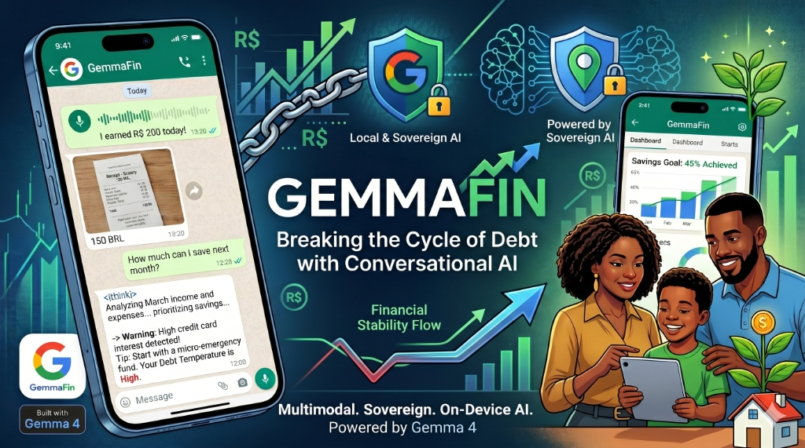
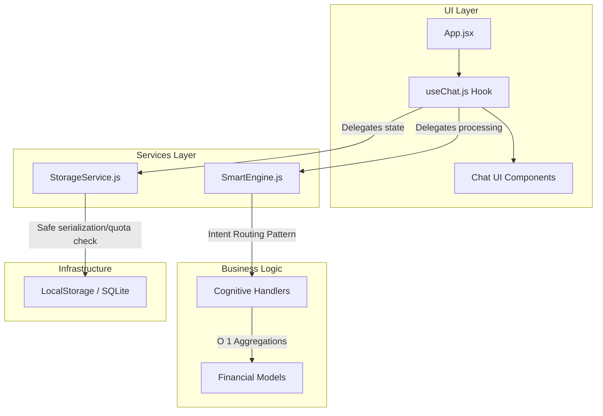

# GemmaFin - Breaking the Cycle of Debt with Conversational AI



[](https://blog.google/technology/ai/google-gemma-4-ai-model/)
[](https://opensource.org/licenses/MIT)
[](https://web.dev/progressive-web-apps/)
[]()
[]()

> **An AI-powered personal finance Progressive Web App (PWA) specifically designed for low-income Brazilian families and informal workers. It leverages the multimodal power of Gemma 4 E2B to turn financial management from a burden into a conversation.**

---

## 📖 Executive Summary

In 2026, Brazil faces a structural household debt crisis. A staggering **80.9% of families are in debt**. Traditional budgeting apps have failed because they require high financial literacy and impose severe cognitive friction.

**GemmaFin** subverts this paradigm. Built specifically for low-income families and informal workers, GemmaFin is a Progressive Web App (PWA) that mimics a simple messaging interface. Instead of filling out spreadsheets, the user simply "talks" to the app:

*   **Audio Inputs for the Informal Economy:** Send a voice memo about daily earnings and expenses.
*   **Visual Inputs for Messy Realities:** Snap a photo of a crumpled grocery receipt or a bank statement.
*   **Real-Time Point-of-Sale Advisor:** Real-time AI advice on whether to use installments or pay cash.
*   **Debt Rescue & Refinancing:** Proactive interventions against high-interest revolving credit.

---

## 🛠️ System Architecture

GemmaFin is designed with **Clean Architecture** as an offline-first Progressive Web App (PWA), isolating core business logic from UI components to ensure O(1) performance calculations and resilient state management.



### Architecture Improvements
- **Clean Architecture & Decoupling:** `useChat.js` now acts solely as a UI orchestrator. The heavy lifting for intent recognition and cognitive processing is delegated to `SmartEngine.js`.
- **Resilient State Persistence:** `StorageService.js` handles schema validation, quota limit errors, and fallback recovery.
- **Optimized Algorithms:** $O(n^2)$ bottlenecks were replaced with $O(1)$ lazy evaluation within `SmartEngine.js`, vastly improving the performance over long chat sessions.

---

## ⚙️ Getting Started

### Prerequisites
*   Node.js (v20 or higher)
*   npm or yarn

### Installation
1. Clone the repository:
   ```bash
   git clone https://github.com/your-username/gemmafin.git
   ```
2. Install dependencies:
   ```bash
   npm install
   ```
3. Run the development server:
   ```bash
   npm run dev
   ```
4. Build for production (PWA):
   ```bash
   npm run build
   ```
5. Run Tests:
   ```bash
   npm run test
   ```

---

## 🧠 How I Used Gemma 4

To build a financial assistant for vulnerable populations, two things are absolutely non-negotiable: **Privacy and Zero-Friction Multimodality**. For these reasons, the **Gemma 4 E2B** (Effective 2 Billion) model was the perfect and only logical fit for this architecture.

*   **On-Device Privacy (Zero Data Exposure):** Financial data is highly sensitive. The E2B model is optimized for edge devices and runs locally with an incredibly small memory footprint.
*   **Native Audio & Vision Understanding:** Gemma 4 E2B natively supports text, high-resolution images, and raw audio.
*   **Agentic Workflows via `<|think|>` and Function Calling:** GemmaFin uses native structured JSON function calling to autonomously trigger the local ledger updates.

---

## 🎯 Demo Flow (End-to-End)
1.  **Welcome & Context:** The user is greeted by GemmaFin.
2.  **Multimodal Capture (Audio):** The user triggers an audio simulation (e.g., reporting a 'bico' of R$ 200).
3.  **Agentic Reasoning (`<|think|>`):** The AI displays its internal thought process.
4.  **Multimodal Capture (Image):** The user sends a bank statement screenshot.
5.  **Proactive Insight:** GemmaFin detects an 11% increase in grocery spending.
6.  **Complex Advisory (POS Engine):** The user asks if they should buy a fridge in installments or cash.
7.  **Debt Rescue Alert:** AI triggers a visual warning card comparing revolving interest vs. a personal loan.

## 📺 Demo

[Watch the Demo Video](https://youtu.be/qx22-iVnBVI)  

---

## 📄 License

This project is licensed under the MIT License - see the [LICENSE](LICENSE) file for details.

---

**Built with ❤️ for the Google Gemma Challenge 2026.**
